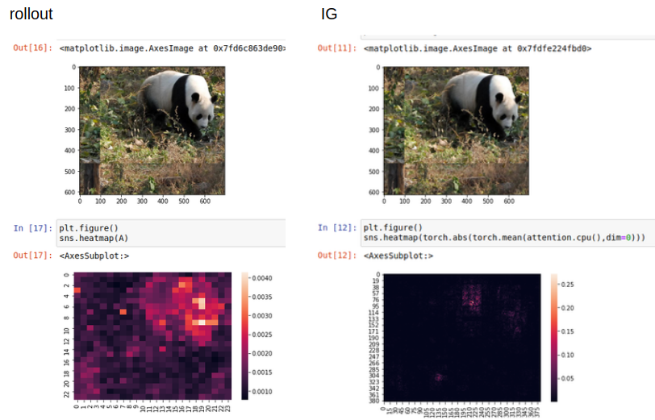

# Some Drawbacks of ViT

This is a [PyTorch](http://pytorch.org) implementation for exploring the attention mechanism of ViT. The methods in my experiments including [ViT](https://arxiv.org/abs/1703.01365), [IG](https://arxiv.org/abs/1703.01365), [rollout](https://arxiv.org/abs/2005.00928), [PGD](https://arxiv.org/abs/1706.06083), and also the new attack method especially for TiV to fool the attention mechanism while maintain the prediction correct. The method achieves only 0.4 cosine similarity for attention map while maintain around 100% label in imagenette data set.
<p align="center">

</p>

## Experimental Results

We used the pretrained deep learning model [ViT](https://github.com/lukemelas/PyTorch-Pretrained-ViT). We have varied experiment on ViT showing the drawbacks of ViT. The experimental results are shown as follows.

## Running the code

### Dependencies
* python 3.7
* CUDA 10.2
* PyTorch with GPU
* Anaconda3
* pytorch_pretrained_vit
* seaborn
* matplotlib

### Downloading  Out-of-Distribtion Datasets
We provide download links of [imagenette dataset](), for reproducing the experiment results, plz download the dataset and unzip it to the \Attention-ViT folder as the \Attention-ViT\data.


### Rollout and IG

For rollout:
```
python ViT_IG.py
```
For IG:
```
python ViT_rollout.py
```
We can find out that the rollout method is a better method for visualizing ViT network.
<p align="center">

</p>

### PGD and AttentionAttack
For PGD:
```
python ViT_pgd.py
```
For AttentionAttack:
```
python ViT_change_attention.py
```
### Visualize Attention Trend
We point out the drawbacks of the attention mechanism in ViT. The attention maps of the deep layers really have some rediculous attention.
```
python ViT_rollout_trend.py
```
The attention maps are in the folder \panda1 and \monkey1. And you can also find them in the presentation slides \Some Draw Backs of ViT.pptx

